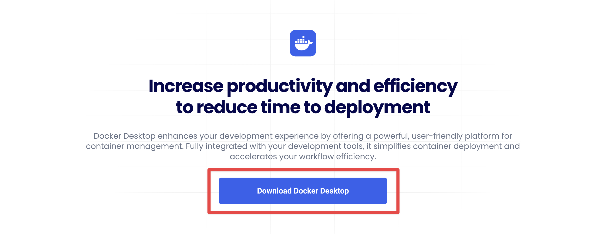
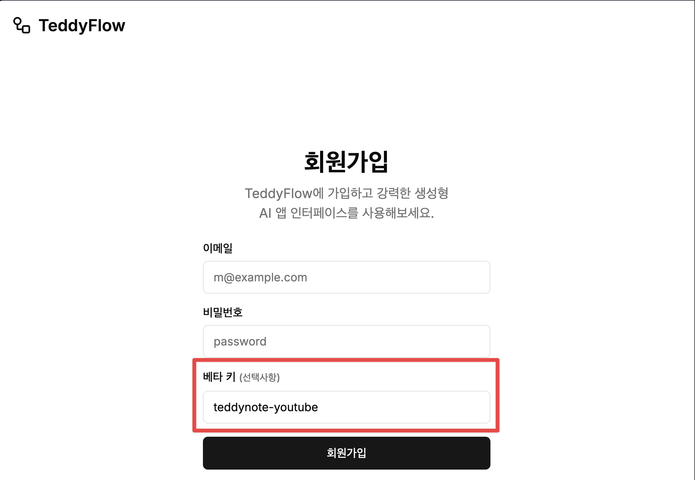
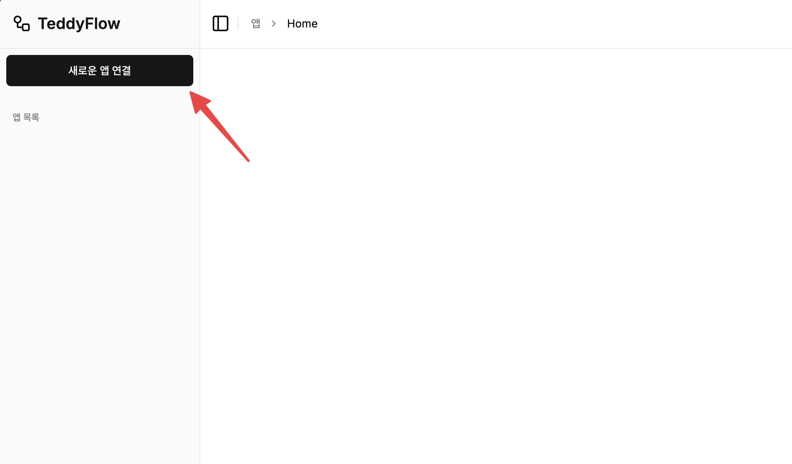
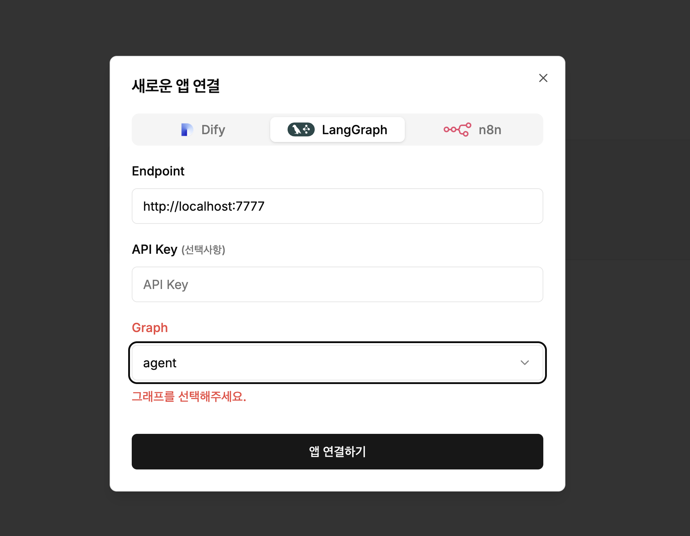

# LangChain/LangGraph Q&A Agent

## 프로젝트 개요


`LangChain/LangGraph Q&A Agent`은 LangChain AI 의 공식 도큐먼트, 테디노트의 위키독스, 튜토리얼 등의 자료를 모은 MCP 서버인 `langchain-dev-docs` 를 사용하는 ReAct 에이전트입니다.

본 Repository 는 쉽게 구동하고 누구나가 개인화된 LangChain/LangGraph Q&A Agent 를 구동할 수 있도록 Docker Image 로 배포하였습니다.

## 실행 방법

### 다운로드

다음의 명령어로 프로젝트를 다운로드 받습니다.

```bash
git clone https://github.com/teddynote-lab/langgraph-qna-agent.git
cd langgraph-qna-agent
```

### 프로젝트 설정

1. `.env.example` 파일을 `.env` 파일로 복사하고 필요한 API 키를 추가합니다.

아래는 필요한 API 키 목록입니다.

```
ANTHROPIC_API_KEY=your_anthropic_api_key
LANGSMITH_API_KEY=your_langsmith_api_key
```

(참고) 여기서는 Anthropic 의 Claude Sonnet 3.7 Latest 모델을 사용하였습니다.

- Anthropic API 발급하기: https://console.anthropic.com/settings/keys
- LangSmith API 발급하기: https://smith.langchain.com

2. 도커 설치

다음의 링크에 접속하여 Docker Desktop 을 다운로드 받아 설치합니다.

- 링크: https://www.docker.com/products/docker-desktop/



3. 도커 실행

다음의 명령어로 Docker Desktop 을 실행합니다.

```bash
docker compose up -d
```

### teddyflow.com 연결

다음은 채팅 인터페이스로 활용하고 있는 teddyflow.com 에 연결하는 방법입니다.

1. teddyflow.com 에서 회원가입을 합니다.

회원가입시 "베타 키" 에 `teddynote-youtube` 를 입력하면 승인 없이 바로 가입이 가능합니다.



3. 로그인 후 "새로운 앱 연결" 버튼을 클릭합니다.



4. 앱 이름을 입력하고 "연결" 버튼을 클릭합니다.
5. 탭에서 "LangGraph" 를 선택한 뒤 다음의 정보를 입력합니다.
- Endpoint: `http://localhost:7777`
- Graph: `agent`



6. 연결 설정이 완료되면 "저장" 버튼을 클릭합니다.

7. "앱 연결하기" 버튼을 눌러 저장합니다.


### 연결 종료

다음의 명령어로 연결을 종료할 수 있습니다.

```bash
docker compose down
```


## 라이센스

MIT License